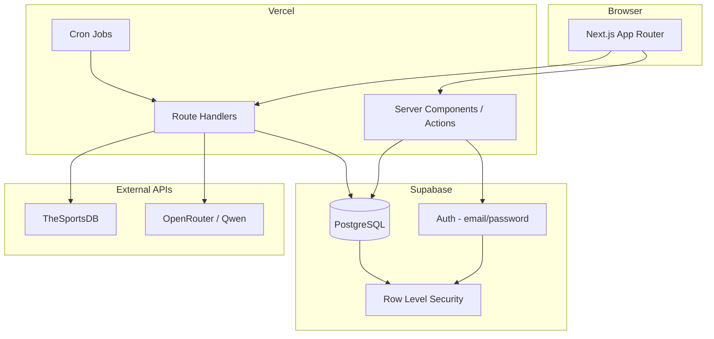

# Architecture

Football Stake Tracker is a private-group platform for pooling virtual stakes on FIFA World Cup 2026 bets **against external markets** (e.g. Polymarket). Friends co-invest; net PnL is split **proportionally** by stake share.

## Stack

| Layer | Technology |
|---|---|
| Frontend | Next.js 15 (App Router), TypeScript, Tailwind CSS 4, ShadCN UI |
| Backend | Supabase (Postgres, Auth, RLS) |
| Football data | TheSportsDB (cached in Supabase) |
| AI (later) | OpenRouter → Qwen |
| Deployment | Vercel |

## High-level diagram



## Request flow

### Authenticated page load

1. Middleware refreshes Supabase session cookie (`src/middleware.ts`).
2. Server Component calls `createClient()` from `src/lib/supabase/server.ts`.
3. RLS enforces read/write policies per user role.

### Bet join + stake lock (Phase 4)

1. User submits stake on open bet.
2. Server Action validates balance, bet status, lock deadline.
3. Transaction (Postgres function): deduct wallet → insert participation → ledger `stake_lock` → activity log.
4. `share_pct` recalculated for all participations when pool changes.

### Settlement (Phase 5)

1. **Auto rules** (`match_winner`, etc.): cron or host trigger evaluates rule against cached `matches` row.
2. **Manual market rules**: host enters `net_result` (profit/loss vs Polymarket).
3. `calculateProportionalPayouts()` splits result across participations.
4. Ledger entries: `settlement_payout` or `settlement_loss`; wallets updated; bet → `settled`.

## Folder structure

```
src/
├── app/                    # Routes (pages + API)
│   ├── api/cron/           # Vercel cron handlers
│   ├── dashboard/
│   ├── matches/
│   ├── bets/
│   └── activity/
├── components/
│   ├── layout/
│   └── ui/                 # ShadCN primitives
├── lib/
│   ├── supabase/           # Browser + server clients
│   ├── thesportsdb/        # External football API (Phase 4)
│   ├── openrouter/         # AI client (Phase 5+)
│   └── settlement/         # Proportional payout math
└── types/
    ├── database.types.ts   # Supabase schema types
    └── bet-rules.ts        # Structured bet rule union

supabase/
└── migrations/             # SQL schema + RLS

docs/                       # System design reference
```

## Security model

- **Auth**: Supabase email/password; invite token validated at signup.
- **RLS**: Participants read group data; host has elevated wallet/bet policies.
- **Service role**: Cron jobs and settlement writes only in Route Handlers / Edge Functions — never exposed to client.
- **Cron**: Protected by `CRON_SECRET` header (Vercel injects automatically).

## Deployment topology (free tier)

| Service | Plan | Usage |
|---|---|---|
| Vercel | Hobby | Next.js hosting, cron, serverless API |
| Supabase | Free | 500 MB DB, 50k MAU auth, Realtime optional |
| TheSportsDB | Free/paid | Fixture & stats sync — cache in DB |
| OpenRouter | Pay-as-go | AI features deferred to Phase 5+ |

## Environment variables

See `.env.example`. Required: Supabase keys, `THESPORTSDB_API_KEY`, `CRON_SECRET`. Phase 5+: `OPENROUTER_API_KEY`.

## Phase map

| Phase | Focus |
|---|---|
| **1** (current) | System design, schema, project scaffold |
| **2** | Auth, invites, wallets, ledger, activity |
| **3** | Authentication & user management |
| **4** | TheSportsDB sync, match browser |
| **5** | Bet CRUD, join pool, stake locking |
| **6** | Settlement engine, host admin, dashboard polish |
