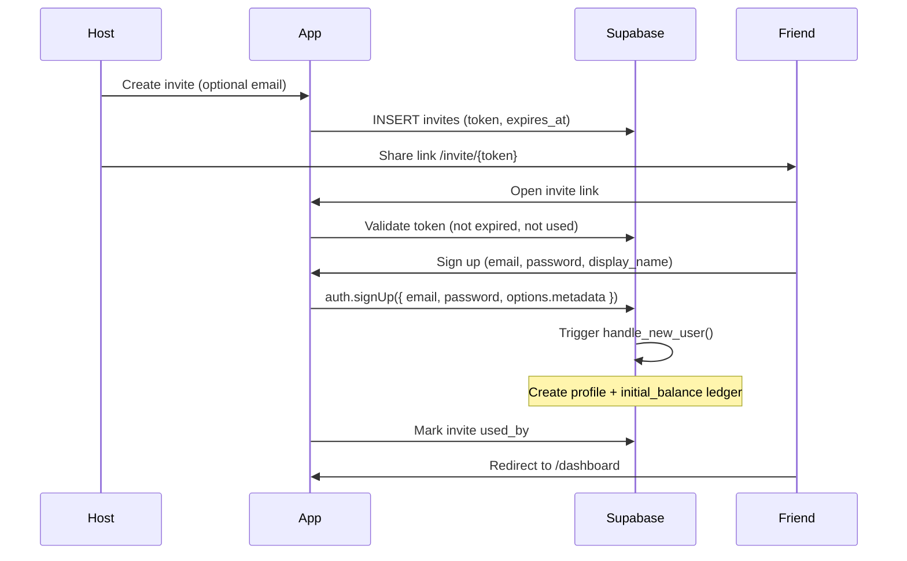

# Auth Flow

Private friend group: **invite links** + **email/password** via Supabase Auth.

## Roles

| Role | Capabilities |
|---|---|
| `participant` | Join bets, view group data, manage own profile |
| `host` | All participant abilities + create invites, adjust wallets, create/settle/void bets |

First user (or manually promoted in Supabase) should be `host`.

## Signup flow



## Login flow

1. User visits `/login`.
2. `supabase.auth.signInWithPassword({ email, password })`.
3. Middleware refreshes session on subsequent requests.
4. Protected routes check `auth.getUser()` server-side.

## Route protection (Phase 2)

| Route | Auth | Role |
|---|---|---|
| `/`, `/login`, `/signup`, `/invite/[token]` | Public | — |
| `/dashboard`, `/matches`, `/bets`, `/activity` | Required | any |
| `/admin/*` | Required | host |

Middleware pattern:

```typescript
const { data: { user } } = await supabase.auth.getUser();
if (!user) redirect("/login");
```

Host guard in layout or page:

```typescript
const { data: profile } = await supabase
  .from("profiles")
  .select("role")
  .eq("id", user.id)
  .single();

if (profile?.role !== "host") redirect("/dashboard");
```

## Invite token rules

- Cryptographically random (e.g. `crypto.randomUUID()` or 32-byte hex).
- Default expiry: **7 days**.
- Single use: `used_by` set on successful signup.
- Optional `email` field for UX pre-fill (not enforced by Supabase — honor system).

## Session handling

- `@supabase/ssr` cookie-based sessions.
- `src/middleware.ts` calls `updateSession()` on every matched route.
- Server Components use `src/lib/supabase/server.ts`.
- Client Components use `src/lib/supabase/client.ts`.

## Bootstrap host (one-time)

After first signup via Supabase dashboard or SQL:

```sql
update public.profiles
set role = 'host'
where id = '<first-user-uuid>';
```

Alternatively pass `role: 'host'` in `raw_user_meta_data` for the very first account only.

## Security notes

- Email confirmation disabled in local config for dev (`enable_confirmations = false`). Enable in production if desired.
- Never expose `SUPABASE_SERVICE_ROLE_KEY` to the client.
- Wallet mutations must go through server-side RPC — not direct client updates to `wallet_balance`.

## Planned pages (Phase 2)

```
/login
/signup?invite={token}
/invite/[token]     → redirects to signup with token
/auth/callback      → Supabase OAuth callback (future)
```
