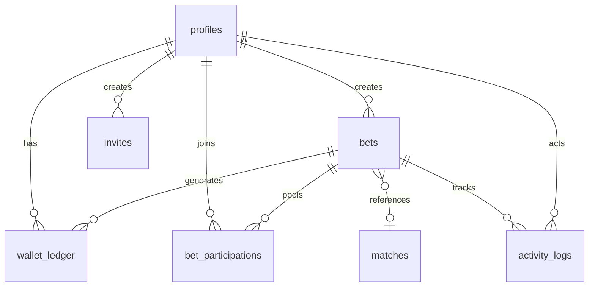

# Data Model

## Entity relationship



## Product-level core entities

These are the conceptual entities used in product and API discussions. They map to concrete Supabase tables/columns below.

### User

```ts
User {
  id
  name
  email
  walletBalance
}
```

Mapping:
- `profiles.id` -> `id`
- `profiles.display_name` -> `name`
- `auth.users.email` -> `email`
- `profiles.wallet_balance` -> `walletBalance`

### Match

```ts
Match {
  id
  homeTeam
  awayTeam
  startTime
}
```

Mapping:
- `matches.id` -> `id`
- `matches.home_team_name` -> `homeTeam`
- `matches.away_team_name` -> `awayTeam`
- `matches.kickoff_at` -> `startTime`

### Bet

```ts
Bet {
  id
  matchId
  title
  description
  stake
  payoutMultiplier
  status
}
```

Mapping:
- `bets.id` -> `id`
- `bets.match_id` -> `matchId`
- `bets.title` -> `title`
- `bets.description` -> `description`
- `bet_participations.stake_amount` -> `stake` (per participant)
- `payoutMultiplier` is derived from final settlement (`net_result` and total pool), not stored as a single column
- `bets.status` -> `status`

### Bet Participant

```ts
BetParticipant {
  userId
  betId
  contribution
  sharePercentage
}
```

Mapping:
- `bet_participations.user_id` -> `userId`
- `bet_participations.bet_id` -> `betId`
- `bet_participations.stake_amount` -> `contribution`
- `bet_participations.share_pct` -> `sharePercentage`

### Transaction

```ts
Transaction {
  id
  userId
  amount
  type
  timestamp
}
```

Mapping:
- `wallet_ledger.id` -> `id`
- `wallet_ledger.user_id` -> `userId`
- `wallet_ledger.amount` -> `amount`
- `wallet_ledger.entry_type` -> `type`
- `wallet_ledger.created_at` -> `timestamp`

## Phase 2 Supabase table contracts

The app stores canonical data in Phase 1 tables (`profiles`, `bet_participations`, `wallet_ledger`, etc.).
Phase 2 adds contract-compatible names/aliases so APIs can use the product vocabulary below.

### `users`

```
id
name
email
wallet_balance
created_at
```

Implemented as view: `public.users`.

### `matches`

```
id
fixture_id
home_team
away_team
kickoff_time
status
```

Implemented on table: `public.matches` (alias/generated columns over canonical fields).

### `bets`

```
id
match_id
title
description
stake
payout_multiplier
result
status
created_by
```

Implemented on table: `public.bets`.
Notes:
- `result` is an alias to `net_result`.
- `stake` and `payout_multiplier` are explicit nullable columns for Phase 2 API compatibility.

### `bet_participants`

```
id
bet_id
user_id
share_percentage
contribution
```

Implemented as view: `public.bet_participants` over `public.bet_participations`.

### `transactions`

```
id
user_id
amount
type
created_at
```

Implemented as view: `public.transactions` over `public.wallet_ledger`.

### `activity_logs`

```
id
action
user_id
metadata
created_at
```

Implemented on table: `public.activity_logs` (alias/generated columns over event fields).

## Core tables

### `profiles`

Extends `auth.users`. One row per friend.

| Column | Type | Notes |
|---|---|---|
| `id` | uuid PK | FK → `auth.users` |
| `display_name` | text | Shown in UI |
| `role` | enum | `host` \| `participant` |
| `wallet_balance` | numeric | Denormalized; source of truth is ledger |

### `invites`

Host-generated signup links.

| Column | Type | Notes |
|---|---|---|
| `token` | text unique | URL segment `/invite/[token]` |
| `email` | text nullable | Optional pre-fill |
| `expires_at` | timestamptz | Default 7 days |
| `used_by` | uuid nullable | Set on successful signup |

### `matches`

Cached TheSportsDB fixtures — **WC 2026 only**.

Synced via cron; bets reference `match_id` for auto-settlement rules.

### `bets`

A pooled market position shared by the group.

| Column | Type | Notes |
|---|---|---|
| `title` | text | Human-readable |
| `market_reference` | text | Polymarket URL or market ID |
| `rule` | jsonb | See `src/types/bet-rules.ts` |
| `status` | enum | Lifecycle state |
| `net_result` | numeric | Total pool PnL vs market (+/-) |
| `lock_at` | timestamptz | No new stakes after this |

**Status lifecycle**

```
draft → open → locked → pending_settlement → settled
                                          ↘ void
```

### `bet_participations`

| Column | Type | Notes |
|---|---|---|
| `stake_amount` | numeric | Units locked from wallet |
| `share_pct` | numeric | `stake / total_pool` at lock time |
| `payout_amount` | numeric | Set on settlement |

Unique constraint: one participation per user per bet.

### `wallet_ledger`

Append-only financial audit trail.

| Entry type | Direction | When |
|---|---|---|
| `initial_balance` | + | Signup |
| `host_credit` | + | Host adds funds |
| `host_debit` | − | Host removes funds |
| `stake_lock` | − | Join bet |
| `stake_release` | + | Bet voided before settle |
| `settlement_payout` | + | Win share returned |
| `settlement_loss` | − | Loss share (if payout < stake) |
| `void_refund` | + | Full stake returned |

### `activity_logs`

Human-readable event feed. `metadata` jsonb holds context (amounts, titles).

## Proportional settlement math

Given participations with stakes `[40, 30, 30]` (total 100) and `net_result = +50`:

| User | Share | Payout | Net PnL |
|---|---|---|---|
| A | 40% | 40 + 20 = 60 | +20 |
| B | 30% | 30 + 15 = 45 | +15 |
| C | 30% | 30 + 15 = 45 | +15 |

Implementation: `src/lib/settlement/proportional.ts`

Loss example (`net_result = -30`): A gets 40 − 12 = 28 (−12 PnL).

## Bet rule schema

Rules are typed JSON — not free text — for auto-evaluation:

```json
{ "type": "match_winner", "matchId": 12345, "selection": "home" }
```

```json
{
  "type": "manual_market",
  "marketReference": "https://polymarket.com/event/...",
  "description": "Brazil to win Group G"
}
```

Manual market bets require host to enter `net_result` after Polymarket settles.

## Indexes

- `matches(kickoff_at)`, `matches(status)` — fixture browser
- `bets(status)`, `bets(match_id)` — open bets, settlement batch
- `wallet_ledger(user_id, created_at desc)` — user history
- `activity_logs(created_at desc)` — feed pagination

## RLS summary

| Table | Participant | Host |
|---|---|---|
| profiles | Read all; update own | Update any wallet via RPC |
| bets | Read all | Create, update, settle |
| participations | Read all; insert own | — |
| ledger | Read own | Read all |
| activity | Read all | Insert |

Sensitive writes (settlement, host debit) should use **Postgres RPC functions** with `security definer` in Phase 2+ to avoid client-side balance manipulation.
